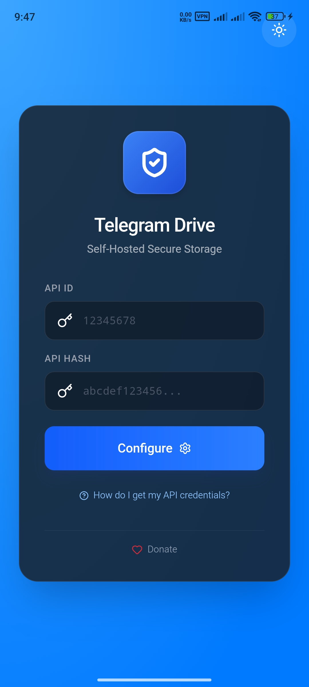
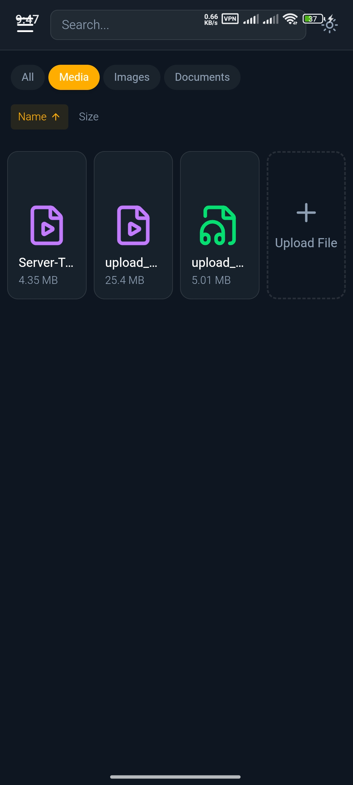
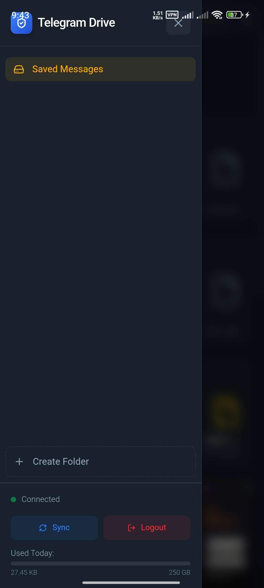
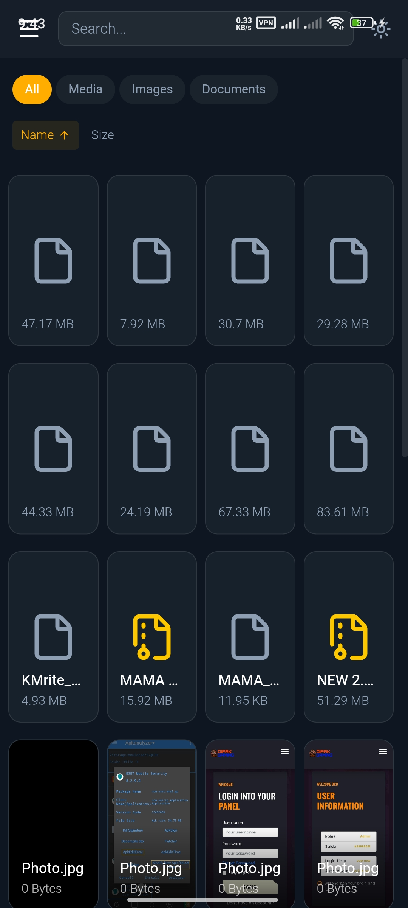
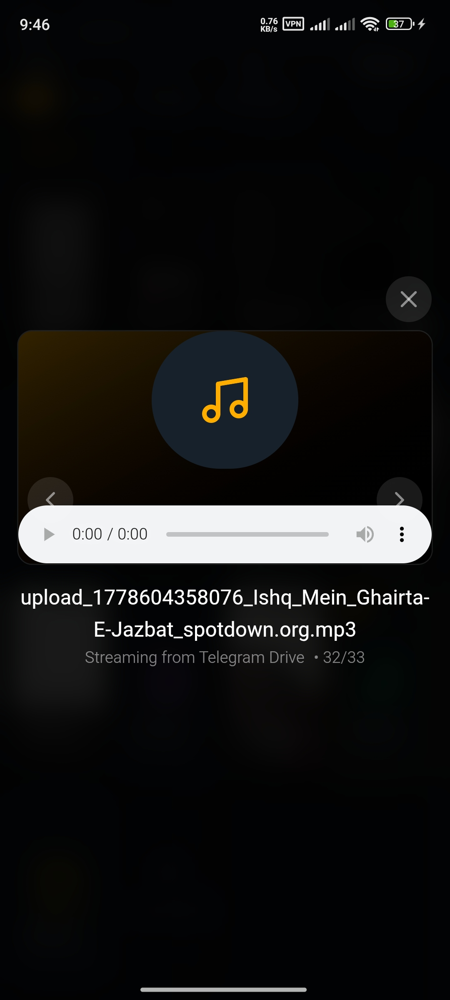
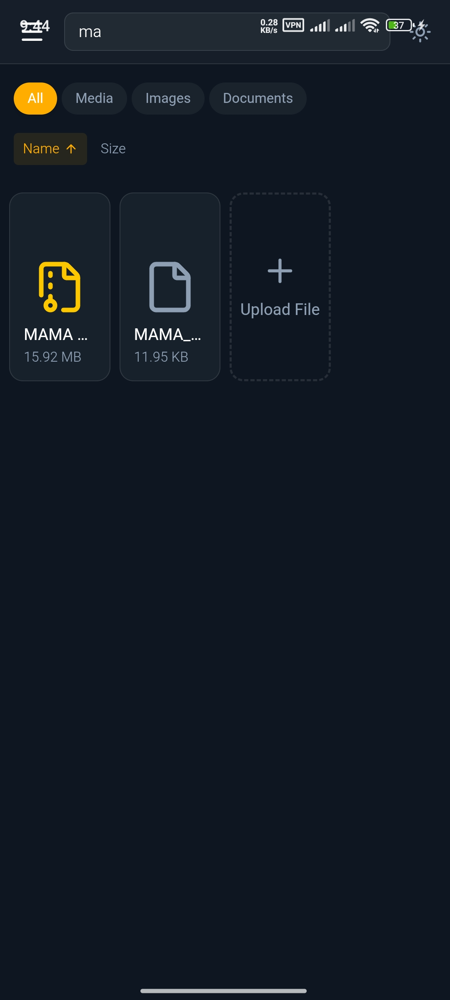

# 🚀 Telegram Drive (Desktop & Mobile)

**Telegram Drive** is an open-source, cross-platform application that turns your Telegram account into an unlimited, secure cloud storage drive. Originally built for Desktop, this fork introduces **full Native Android support** using Tauri v2, featuring a custom HTML5 chunking engine to handle massive mobile file uploads without memory crashes.


![Hero Showcase]

## 🌟 What's New in This Version (Mobile Support)

This repository extends the original desktop client with robust mobile capabilities:
* **📱 Native Android APK:** Compiled using the latest Tauri v2 mobile toolchain.
* **⚡ SAF Bypass Engine:** Bypasses the restrictive Android Storage Access Framework using a custom web `<input>` architecture to capture file bytes natively.
* **📦 Large File Chunking:** Implements a `File.slice()` loop that streams data in 2MB chunks directly to the `appCacheDir`, preventing WebView Out-Of-Memory (OOM) crashes and allowing gigabyte-sized uploads on mobile.
* **👆 Mobile-Optimized UI:** A responsive, touch-friendly slide-out drawer with backdrop blur that seamlessly replaces the desktop sidebar on small screens.

## 💻 Core Desktop Features
* **Unlimited Cloud Storage**: Utilizes Telegram's cloud infrastructure.
* **High Performance Grid**: Virtual scrolling (`@tanstack/react-virtual`) handles folders with thousands of files instantly at 60FPS.
* **Media Streaming**: Stream video and audio files directly without downloading.
* **Folder Management**: Create "Folders" (private Telegram Channels) to organize content.
* **Privacy Focused**: API keys and data stay local. No third-party servers.

## 📸 Screenshots

### Mobile View
| Item Filtering | Preview | Sidebar |
| :---: | :---: | :---: |
|  |  |  |

| Grid View | Audio Playback | Item Search |
| :---: | :---: | :---: |
|  |  |  |

## 🛠 Tech Stack

* **Frontend**: React, TypeScript, TailwindCSS, Framer Motion
* **Backend**: Rust (Tauri v2), Grammers (Telegram Client)
* **Mobile Engine**: Android NDK, HTML5 Chunking Bypass

## 🚀 Getting Started

### Prerequisites
* **Node.js (v18+)**
* **Rust (latest stable)**
* **Android Studio & NDK:** Required specifically if you want to compile the Android APK locally.
* **Telegram API Credentials**: Get your `api_id` and `api_hash` from [my.telegram.org](https://my.telegram.org).

### Installation & Local Development

1.  **Clone the repository**
    ```bash
    git clone [https://github.com/RaeesRizwan09/Telegram-Drive.git](https://github.com/RaeesRizwan09/Telegram-Drive.git)
    cd Telegram-Drive/app
    ```

2.  **Install Dependencies**
    ```bash
    npm install
    ```

3.  **Run in Development Mode (Desktop)**
    ```bash
    npm run tauri dev
    ```

4.  **Build the Android APK**
    To compile the universal Android application locally:
    ```bash
    npm run tauri android init
    npx tauri android build
    ```
    *The generated APKs will be located in `src-tauri/gen/android/app/build/outputs/apk/release/`.*

## 🤝 Credits & Open Source
This project is a modified fork. Massive credit to the original creator **[caamer20](https://github.com/caamer20/Telegram-Drive)** for building the foundational desktop architecture and Telegram API bridge.

Licensed under the **MIT License**.
